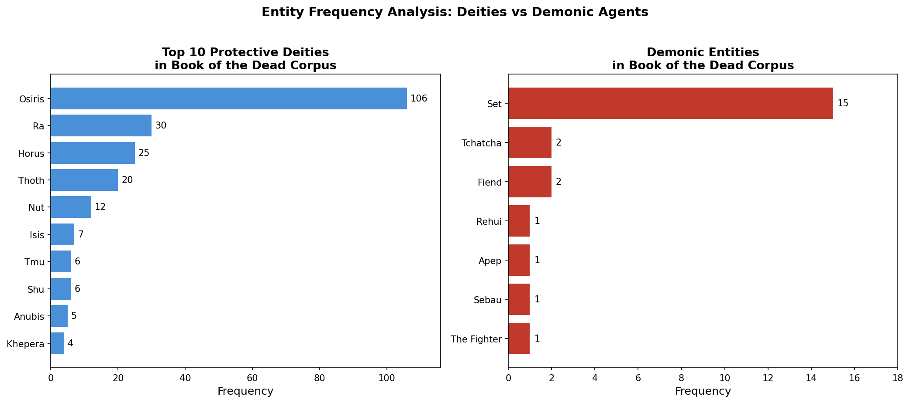
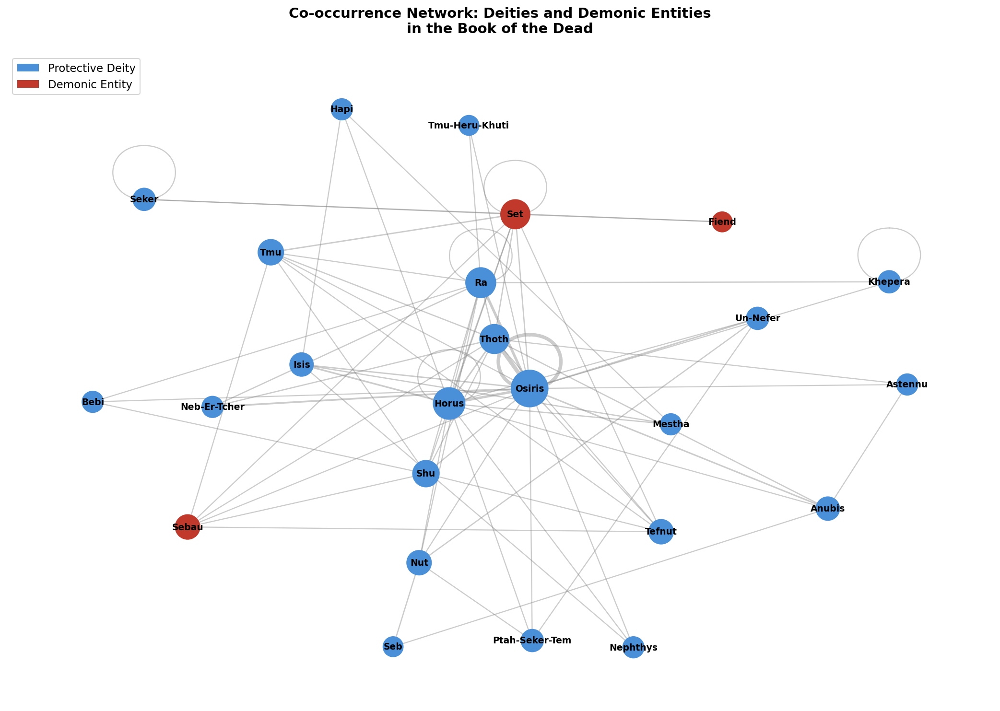
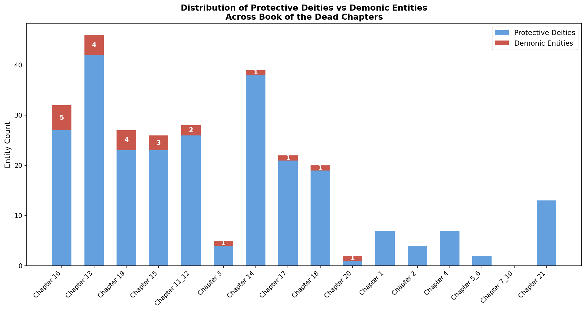

# Demonic and Protective Entities in the Book of the Dead
### A Computational Demonology Using NLP and Named Entity Recognition

**Author:** Juhi Jadhav  
**Field:** Digital Humanities / Computational Egyptology  
**Status:** Ongoing Research Project

---

## Overview

This project applies Natural Language Processing to ancient Egyptian funerary texts , specifically the *Book of the Dead* (Budge translation) to identify, classify, and analyze demonic and protective supernatural entities computationally.

Standard NLP tools fail on ancient translated texts. This project builds a **domain-specific Named Entity Recognition (NER) system** trained on a custom Egyptian entity taxonomy, and uses it to map the demonological landscape of the *Book of the Dead* at a scale and resolution unavailable to traditional close reading alone.

The research question driving this work:

> *"How are demonic and protective supernatural agents distributed across Book of the Dead spells and what computational patterns reveal about their roles in ancient Egyptian funerary belief?"*

---

## Research Findings

**Finding 1 : Protective deities vastly outnumber demonic entities (11:1 ratio)**  
257 deity mentions vs. 23 demon mentions across the corpus, suggesting that funerary texts functioned primarily as invocations of divine protection rather than apotropaic defenses against evil.

**Finding 2 : Osiris anchors the entire deity network**  
With 106 mentions, Osiris accounts for over 40% of all deity references. Network analysis confirms he is the theological center of the funerary tradition, with all major deities connecting through him.

**Finding 3 : Demonic content concentrates in specific chapter types**  
Chapters 16, 13, and 19, all defensive/protective spell chapters, contain the highest demon counts. Purely invocatory hymn chapters (1, 2, 4, 21) contain zero demonic entities.

**Finding 4 : Set's primary mythological conflict is with solar deities**  
Co-occurrence analysis shows Set appears most frequently alongside Tmu and Ra , consistent with his mythological role as the enemy of the solar cycle.

---

## Visualizations

### Entity Frequency: Deities vs Demonic Agents


### Co-occurrence Network


### Chapter-level Distribution


---

## Methodology

### Entity Taxonomy
A domain-specific entity taxonomy was designed with six categories:

| Category | Description | Examples |
|---|---|---|
| `DEITY` | Protective gods and goddesses | Osiris, Ra, Thoth, Horus, Isis |
| `DEMON` | Demonic and threatening agents | Apep, Set, Sebau, Tchatcha |
| `LOCATION` | Sacred ritual locations | Duat, Amenta, Annu, Hall of Two Truths |
| `OBJECT` | Sacred ritual objects | utchat, urerit crown, sektet boat |
| `RITUAL` | Ceremonial actions | weighing of the heart, judgment |
| `ROLE` | Human and ritual roles | the deceased, the scribe, the doorkeeper |

### Pipeline

```
Raw Text Files (16 chapters)
        ↓
Sentence Tokenization (NLTK)
        ↓
Text Cleaning (regex preprocessing)
        ↓
Bootstrapped Annotation (spaCy + domain dictionary)
        ↓
Custom NER Training (spaCy blank model)
        ↓
Entity Analysis & Visualization (matplotlib, networkx)
```

### Corpus
- 16 chapters from the *Book of the Dead* (E.A. Wallis Budge translation, 1895)
- 407 cleaned sentences
- 527 entity annotations
- 104 unique entities across 6 categories

### Limitations
- All analysis is performed on English translations, not original ancient Egyptian
- The model was trained on dictionary-bootstrapped annotations , performance on truly unseen texts requires additional annotation
- Corpus size (16 chapters) is preliminary; future work will expand to the full papyrus

---

## How to Run

### Requirements
```bash
pip install nltk spacy networkx matplotlib
python -m spacy download en_core_web_sm
```

### Run the Notebook
```bash
jupyter notebook egypt_ner.ipynb
```

Run all cells in order. The notebook is fully commented and self-contained.

---

## Relation to Ongoing Research

This project is part of a larger research portfolio combining NLP and Egyptology, which includes:

- **Project 1:** Computational Analysis of Themes and Genre in Ancient Egyptian Texts (TF-IDF, LDA, sentence embeddings, genre classification)
- **Project 2:** Semantic Search for Historical Texts (vector-based retrieval using sentence embeddings)
- **Project 3 (this project):** Demonic and Protective Entity Analysis using domain-specific NER

Together these projects form a coherent computational research arc analyzing the *Book of the Dead* from three angles: thematic structure, semantic meaning, and entity population.

---

## Future Work

- Expand corpus to the full Papyrus of Ani and additional Book of the Dead manuscripts
- Apply methods directly to transliterated ancient Egyptian text using the Thesaurus Linguae Aegyptiae
- Extend entity taxonomy to include dynasty and provenance metadata
- Cross-genre comparison with Egyptian mythic narratives
- Submit findings to a Digital Humanities conference (DH2027)

---

## Contact

**Juhi Jadhav**  
[LinkedIn](https://www.linkedin.com/in/juhijadhav)
